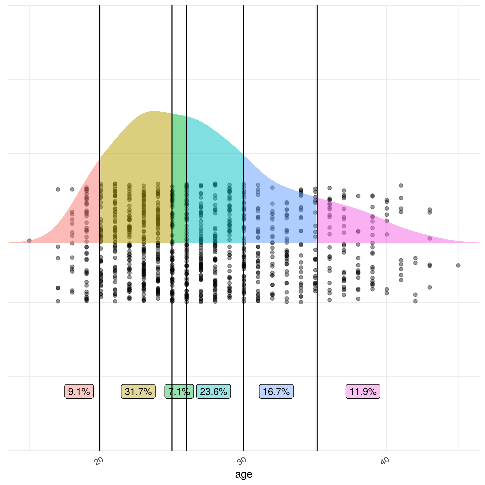
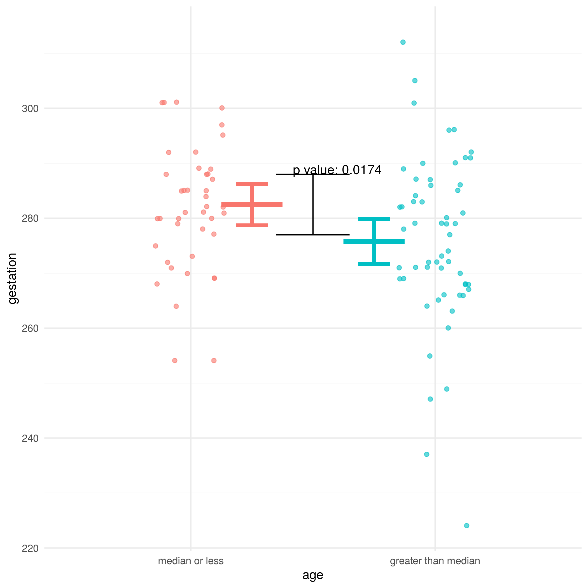
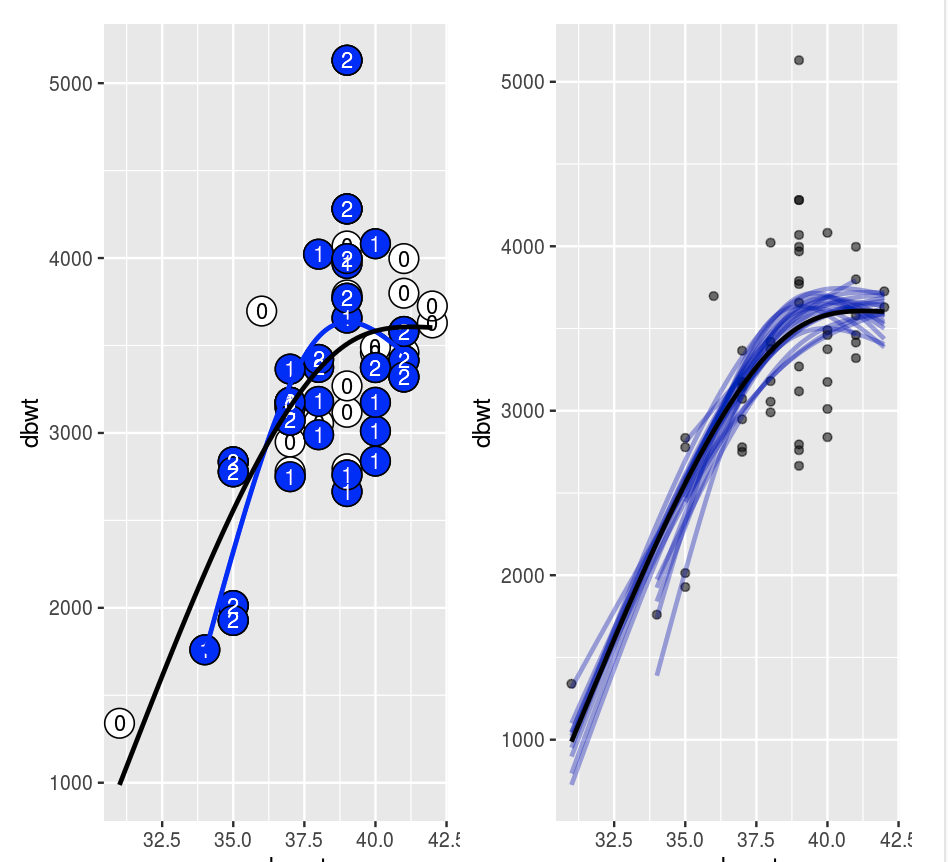
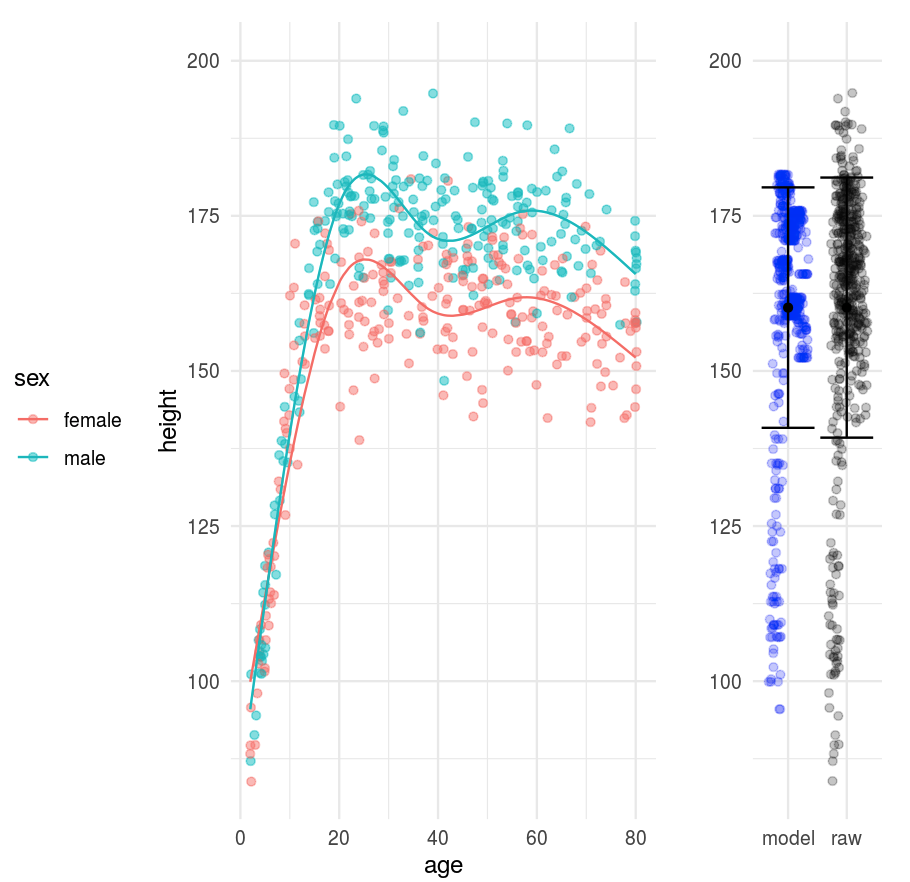

```{r, include = FALSE}
knitr::opts_chunk$set(
  collapse = TRUE,
  comment = "#>")

library(LittleApp2)
library(shiny)
app_url <- function(name) {
  paste0(
    "https://maa-statprep.shinyapps.io/Little_App_", 
    name)
}
```

.

.

.

.

.

App | Graphic | App | Graphic
----|---------|-----|---------
[Center & Spread](`r app_url("Spread")`) |  | [Points & Densities](`r app_url("Density")`) | 
[Confidence & T](`r app_url("T")`) |  | [Resampling](`r app_url("Bootstrap")`) |  
[Stratification](`r app_url("Stratify")`) |  | [Regression](`r app_url("Regression")`) |  

